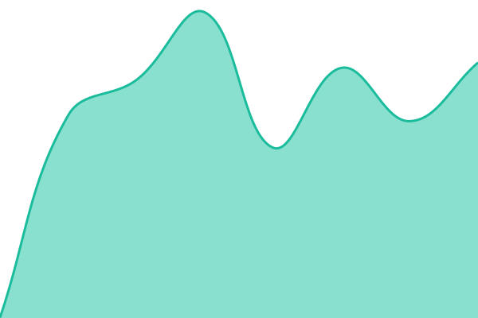

# [📈 Live Status](https://status.awumii.pl): <!--live status--> **🟩 All systems operational**

This repository contains the open-source uptime monitor and status page for [awumii](https://status.awumii.pl), powered by [Upptime](https://github.com/upptime/upptime).

With [Upptime](https://upptime.js.org), you can get your own unlimited and free uptime monitor and status page, powered entirely by a GitHub repository. We use [Issues](https://github.com/awumii/uptime/issues) as incident reports, [Actions](https://github.com/awumii/uptime/actions) as uptime monitors, and [Pages](https://status.awumii.pl) for the status page.

<!--start: status pages-->
<!-- This summary is generated by Upptime (https://github.com/upptime/upptime) -->
<!-- Do not edit this manually, your changes will be overwritten -->
<!-- prettier-ignore -->
| URL | Status | History | Response Time | Uptime |
| --- | ------ | ------- | ------------- | ------ |
|  [Home (awumii.pl)](https://awumii.pl) | 🟩 Up | [home-awumii-pl.yml](https://github.com/awumii/uptime/commits/HEAD/history/home-awumii-pl.yml) | 

 656ms
     
 | 

<a href="https://status.awumii.pl/history/home-awumii-pl">100.00%</a>
    

|  [DNS](https://dns.awumii.pl) | 🟩 Up | [dns.yml](https://github.com/awumii/uptime/commits/HEAD/history/dns.yml) | 

 1129ms
     
 | 

<a href="https://status.awumii.pl/history/dns">100.00%</a>
    

|  [Cockpit](https://panel.awumii.pl) | 🟩 Up | [cockpit.yml](https://github.com/awumii/uptime/commits/HEAD/history/cockpit.yml) | 

 643ms
     
 | 

<a href="https://status.awumii.pl/history/cockpit">94.68%</a>
    

|  [NextCloud](https://cloud.awumii.pl) | 🟩 Up | [next-cloud.yml](https://github.com/awumii/uptime/commits/HEAD/history/next-cloud.yml) | 

 1378ms
     
 | 

<a href="https://status.awumii.pl/history/next-cloud">100.00%</a>
    

|  [NextCloud: Signaling](https://awumii.pl/alive/signaling) | 🟩 Up | [next-cloud-signaling.yml](https://github.com/awumii/uptime/commits/HEAD/history/next-cloud-signaling.yml) | 

 464ms
     
 | 

<a href="https://status.awumii.pl/history/next-cloud-signaling">98.88%</a>
    

|  [NextCloud: NATS](http://edge.awumii.pl:8222) | 🟩 Up | [next-cloud-nats.yml](https://github.com/awumii/uptime/commits/HEAD/history/next-cloud-nats.yml) | 

 333ms
     
 | 

<a href="https://status.awumii.pl/history/next-cloud-nats">100.00%</a>
    

|  [NextCloud: TURN](https://awumii.pl/alive/turn) | 🟩 Up | [next-cloud-turn.yml](https://github.com/awumii/uptime/commits/HEAD/history/next-cloud-turn.yml) | 

 584ms
     
 | 

<a href="https://status.awumii.pl/history/next-cloud-turn">100.00%</a>
    

|  [Vaultwarden](https://pass.awumii.pl/alive) | 🟩 Up | [vaultwarden.yml](https://github.com/awumii/uptime/commits/HEAD/history/vaultwarden.yml) | 

 632ms
     
 | 

<a href="https://status.awumii.pl/history/vaultwarden">100.00%</a>
    

|  [Mumble](https://awumii.pl/alive/mumble) | 🟩 Up | [mumble.yml](https://github.com/awumii/uptime/commits/HEAD/history/mumble.yml) | 

 465ms
     
 | 

<a href="https://status.awumii.pl/history/mumble">94.69%</a>
    

<!--end: status pages-->

[**Visit our status website →**](https://status.awumii.pl)

## 📄 License

- Powered by: [Upptime](https://github.com/upptime/upptime)
- Code: [MIT](./LICENSE) © [Anand Chowdhary](https://anandchowdhary.com)
- Data in the `./history` directory: [Open Database License](https://opendatacommons.org/licenses/odbl/1-0/)
